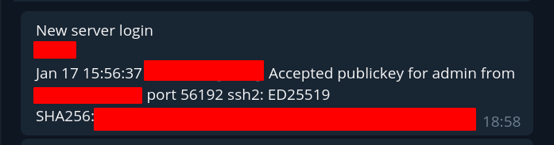

# Info

Notify about new ssh login on your server

## Build
You'll need go v1.13 or later

### Install Go
```shell script
sudo apt-get update
sudo apt-get -y upgrade
wget https://dl.google.com/go/go1.13.3.linux-amd64.tar.gz
sudo tar -xvf go1.13.3.linux-amd64.tar.gz
sudo mv go /usr/local
export GOROOT=/usr/local/go
export GOPATH=$HOME/go
export PATH=$GOPATH/bin:$GOROOT/bin:$PATH
```

### Clone repository and build
```shell script
mkdir "$HOME/go/src"
cd "$HOME/go/src"
git clone https://github.com/abergasov/ssh_notify.git
cd ssh_notify
go build main.go
```

### Set config
```shell script
sudo touch /etc/ssh_notify.conf && sudo nano /etc/ssh_notify.conf 
```

Sample config 
```shell script
SSHLogFile = /var/log/auth.log
TelegramBotToken = YOUR_BOT_TOKEN_HERE
TelegramNotifyChat = YOUR_CHAT_HERE
ServerName = YOUR_SERVER_NAME
```

### Create service and run
```shell script
sudo nano /lib/systemd/system/ssh_notify.service
```
Пихаем сордержимое
```shell script
[Unit]
Description=notify on every ssh_login

[Service]
Type=simple
Restart=always
RestartSec=5s
ExecStart=PATH_TO_HOMEDIR/go/src/ssh_notify/main

[Install]
WantedBy=multi-user.target
```

Start service
```shell script
sudo service ssh_notify start
sudo systemctl enable ssh_notify
```

### Logs
```bash
sudo journalctl -f -u ssh_notify.service
```

### Sample
notify on key login


notify on password login
